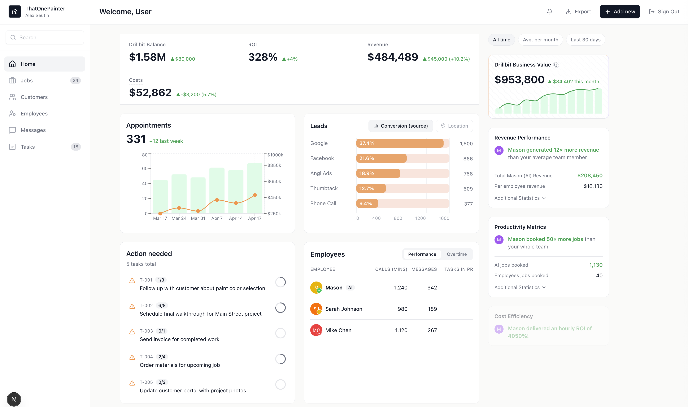

# Tech Dashboard

A production-ready Next.js dashboard application with TypeScript, Supabase, and Tailwind CSS.



## Tech Stack

- **Framework**: Next.js 15 (App Router), React 19, TypeScript
- **Styling**: Tailwind CSS, shadcn/ui, Radix UI
- **Database**: Supabase (PostgreSQL with RLS)
- **Validation**: Zod schemas for API contracts
- **Charts**: Recharts
- **Architecture**: Layered architecture with services pattern

## Project Structure

```
apps/
  web/                       # Next.js application
    app/
      (dashboard)/           # Dashboard routes (layout + page)
      api/                   # API route handlers
        appointments/        # Appointments endpoint
        employees/           # Employees endpoint
        kpi/                 # KPI metrics endpoint
        leads/               # Leads endpoint
        tasks/               # Tasks endpoint
      auth/                  # Auth callback handler
      login/                 # Login page
      signup/                # Signup page
    components/
      dashboard/             # Dashboard components
      ui/                    # shadcn/ui components
    lib/
      api/                   # API types and Zod schemas
        schemas/             # Validation schemas per endpoint
      services/              # Business logic layer
        appointments/        # Appointments service + repo
        employees/           # Employees service + repo
        kpi/                 # KPI service + repo
        leads/               # Leads service + repo
        tasks/               # Tasks service + repo
      supabase/              # Supabase clients (browser, server, service)
      auth.ts                # Auth context helper
      env.ts                 # Environment validation
      rate-limit.ts          # Rate limiting utilities
    middleware.ts            # Auth + rate limiting middleware

tooling/
  scripts/
    migrations/              # SQL migration files
```

## Features

- ✅ Dashboard layout with sidebar navigation
- ✅ KPI summary cards (Drillbit Balance, ROI, Revenue, Costs)
- ✅ Appointments chart (bar + line combo)
- ✅ Leads by source visualization
- ✅ Action needed task list
- ✅ Employees performance table
- ✅ Insight column with business metrics
- ✅ Authentication with Supabase Auth
- ✅ Rate limiting (API + auth routes)
- ✅ Type-safe API with Zod validation
- ✅ Row Level Security (RLS) policies
- ✅ Development mode with mock data

## Getting Started

### 1. Install Dependencies

```bash
cd apps/web
npm install
```

### 2. Environment Variables

Create a `.env.local` file in `apps/web/`:

```env
# Supabase
NEXT_PUBLIC_SUPABASE_URL=your_supabase_url
NEXT_PUBLIC_SUPABASE_ANON_KEY=your_supabase_anon_key
SUPABASE_SERVICE_ROLE_KEY=your_supabase_service_role_key

# OpenAI (optional)
OPENAI_API_KEY=your_openai_api_key
```

### 3. Database Setup

1. Create a new Supabase project at https://supabase.com
2. Run the migration files in order:
   - `tooling/scripts/migrations/001_initial_schema.sql` - Tables, indexes, RLS policies
   - `tooling/scripts/migrations/002_mock_data.sql` - Sample data for development

### 4. Run Development Server

```bash
cd apps/web
npm run dev
```

Visit http://localhost:3000 to see the dashboard.

> **Note**: In development mode, authentication is bypassed and mock data is used automatically.

## Architecture

The application follows a layered architecture:

| Layer | Location | Purpose |
|-------|----------|---------|
| **UI** | `components/`, `app/` | React components and pages |
| **Transport** | `app/api/` | Route handlers, request/response |
| **Service** | `lib/services/*/service.ts` | Business logic, orchestration |
| **Repository** | `lib/services/*/repo.ts` | Data access, Supabase queries |
| **Schema** | `lib/api/schemas/` | Zod validation, type contracts |

## API Endpoints

| Endpoint | Description |
|----------|-------------|
| `GET /api/kpi` | KPI metrics (balance, ROI, revenue, costs) |
| `GET /api/appointments?viewType=chart\|table` | Appointments data |
| `GET /api/leads?viewType=conversion\|location` | Leads by source |
| `GET /api/employees?viewType=performance\|overtime` | Employee data |
| `GET /api/tasks` | Action items / tasks |

All endpoints return a standardized response:

```typescript
{ ok: true, data: T } | { ok: false, error: { code: string, message: string } }
```

## Security

- ✅ Row Level Security (RLS) on all tables
- ✅ Environment variables validated with Zod
- ✅ Server-side authentication checks
- ✅ Rate limiting on API and auth routes
- ✅ No service role keys in client bundles

## Development

```bash
# Start dev server
npm run dev

# Type check
npm run build

# Lint
npm run lint
```

## License

MIT
